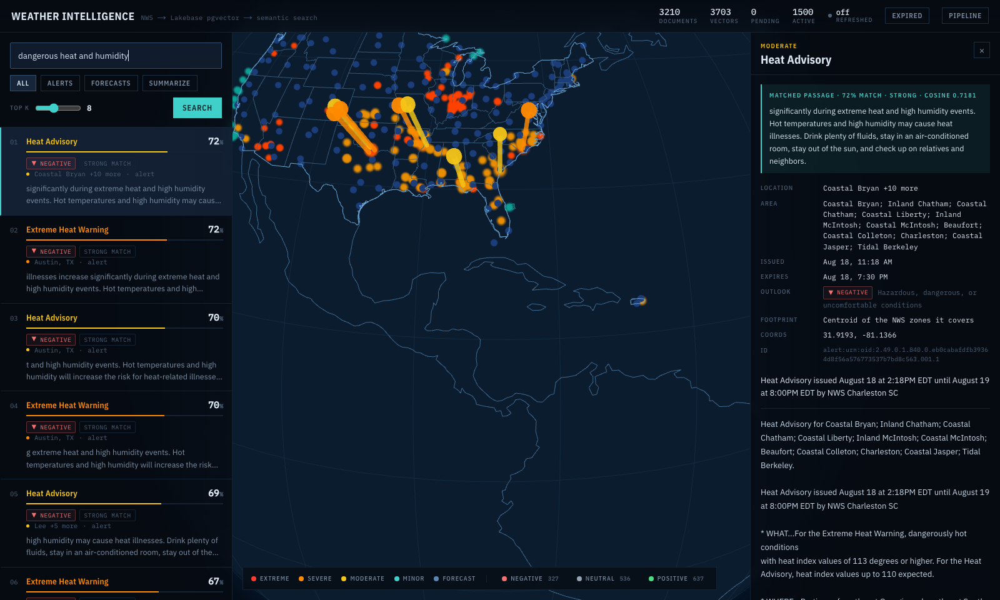
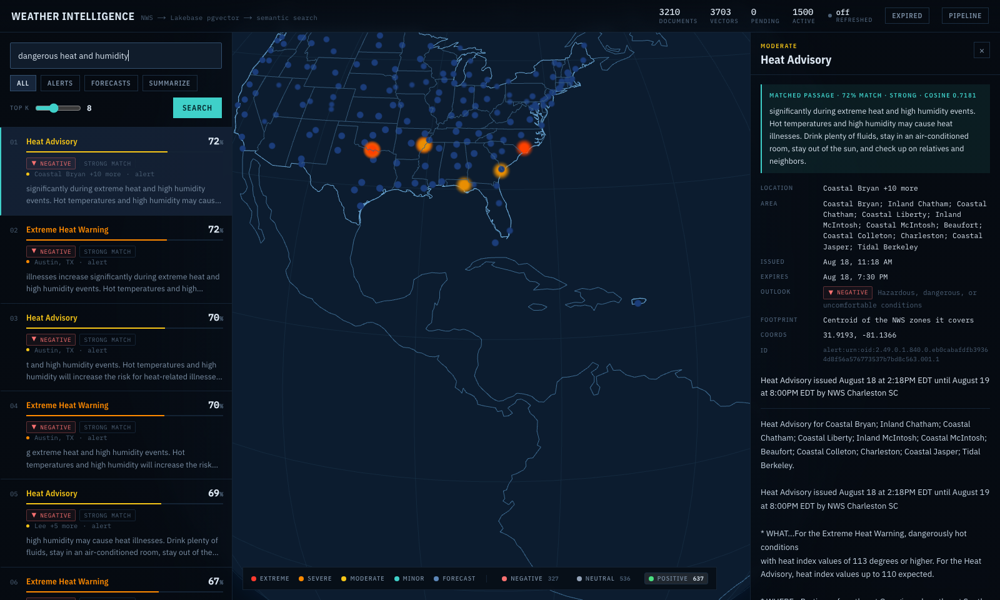

# Weather Intelligence: NWS → Lakebase pgvector → semantic search

Harvests free-text weather from the National Weather Service, chunks and embeds it,
stores the vectors in Lakebase (Postgres + pgvector), and serves semantic search
over the corpus:

```
POST /weather/sync    {"locations": ["Chicago, IL", "Austin, TX"], "limit": 50}
POST /weather/search  {"query": "flash flood risk this weekend", "top_k": 5}
```

Built on the same pattern as the day-2 ticker-news app — `lakebase.py` connection
helper, `execute_values` + `%s::vector` writes, HNSW cosine index, `<=>` retrieval —
against a new unstructured source.


*One query, `"dangerous heat and humidity"`. The left rail ranks the corpus by
cosine similarity — each hit showing its match percentage, a strength band and
whether the weather itself is positive, negative or neutral. On the globe, the
columns rising out of the surface are those same hits, their height being the
similarity; everything else is the live corpus — every active alert nationwide
plus a narrative forecast for 173 cities across all 50 states, DC and Puerto
Rico — each alert drawn at its own geography rather than at the city that
fetched it. The legend counts (`NEGATIVE 327 · NEUTRAL 536 · POSITIVE 637`) are
the sentiment split, and double as filters.*

---

## Live app

**https://weather-vector-app-2808874854650870.aws.databricksapps.com**

Running on Databricks Apps, backed by the `weather-vector-db` Lakebase instance,
refreshing itself every 30 minutes and re-harvesting the whole country daily at
06:00 PT.

**It is not public.** Databricks Apps sits behind an OAuth proxy, so an
unauthenticated visitor is redirected to a Databricks sign-in page rather than
the console — if you click the link and land on a login screen, the app is
working, you just are not signed in to the workspace yet.

### No access? Here it is running

Ten seconds of the deployed console, recorded against the live corpus — search,
ranked results with match percentages and sentiment, a result opened, and the
sentiment filter:


| If you | Then |
|---|---|
| have access to the workspace | open the link and sign in; you land on the console |
| do not | the recording above and the [screenshots](#screenshots) below show it, and [running it end to end](#running-it-end-to-end) takes about five minutes against your own Lakebase |
| have been granted access but see a login loop | you are signed in to a *different* Databricks account in that browser — use a private window |

Access cannot be handed out by URL alone: Databricks Apps authenticates against
the workspace, so a viewer needs an identity in the Databricks **account** before
any app-level permission applies. The app already grants `CAN_USE` to
`account users`; the gap for an outside reviewer is the account, not the app.

To grant someone access, the app owner runs:

```bash
databricks apps set-permissions weather-vector-app --json '{
  "access_control_list": [
    {"user_name": "them@example.com", "permission_level": "CAN_USE"}
  ]
}'
```

`CAN_USE` lets them open the console; `CAN_MANAGE` also allows deploy and delete,
which a reviewer does not need.

### Calling the API directly

The same OAuth applies, so a bare `curl` gets the sign-in HTML rather than JSON.
Send a workspace token:

```bash
URL=https://weather-vector-app-2808874854650870.aws.databricksapps.com
TOKEN=$(databricks auth token | python3 -c 'import json,sys; print(json.load(sys.stdin)["access_token"])')

curl -s -H "Authorization: Bearer $TOKEN" "$URL/weather/stats"

curl -s -H "Authorization: Bearer $TOKEN" -H 'content-type: application/json' \
     -X POST "$URL/weather/search" \
     -d '{"query":"flash flood risk this weekend","top_k":5}'
```

That token is also what `test_deployment.py` uses, so the full suite can be run
against production:

```bash
python test_deployment.py https://weather-vector-app-2808874854650870.aws.databricksapps.com
```


---

## In brief

The four questions, answered directly. Every claim here is expanded further down.

### Which data source, and why

**The National Weather Service API** (`api.weather.gov`). No API key, no signup, no
rate-limit tier — and, unlike most free weather APIs, it publishes genuine
**free text** rather than only numbers. Two document types are harvested:

| Source | Endpoint | The text that gets embedded |
|---|---|---|
| Alerts | `/alerts/active` | `description` + `instruction` — the long-form hazard narrative |
| Forecasts | `/gridpoints/{office}/{x},{y}/forecast` | one `detailedForecast` per period |

I measured before committing to it: across 464 live alerts the narrative ran to a
median of 682 characters and a maximum of 9116, so there is real prose to chunk.
The **hourly** forecast endpoint is deliberately unused — its `detailedForecast`
is empty, leaving nothing worth embedding.

### Schema decisions

**Two tables** (`sql/01`, `sql/02`), plus a small zone-centroid cache (`sql/04`).

| Decision | Why |
|---|---|
| `id` is the natural key — `alert:urn:oid:…` / `forecast:{grid}:{start}` | NWS ids are already globally unique and stable, so upsert dedup needs no hashing. Forecast ids key on period *start*, not number: the numbers shift as periods roll off |
| `text_hash` on documents | NWS revises alerts in place. On an upsert where the hash changed, that document's embedding rows are deleted so the anti-join re-embeds them. Without it, search serves vectors of text the API no longer publishes |
| `source_type` denormalized onto `weather_embeddings` | Lets a filtered search discard rows before the join rather than after |
| `geo_source` on documents | Records whether coordinates came from the alert's own polygon, its zones, or its state — four alerts in five ship no polygon |
| FK with `ON DELETE CASCADE` | Purging an expired alert takes its vectors with it, so orphans cannot accumulate |
| **Chunking: 800 chars, 100 overlap** | Measured, not guessed: 42% of alerts exceed 800 characters and split; forecasts top out near 260 and are always exactly one chunk, so the parameters cost them nothing. The overlap keeps a hazard sentence from being cut across a boundary |
| **Model: `all-MiniLM-L6-v2`, 384 dimensions** | Served through `fastembed`/ONNX rather than `sentence-transformers` — same weights, same vectors, without ~2.5 GB of torch in the image |
| Index: `hnsw (embedding vector_cosine_ops)`, queried with `<=>` | Cosine matches how the model was trained |

### Running it end to end

```bash
uv venv && uv pip install -r requirements.txt
cp .env.example .env            # then set LAKEBASE_URL

# schema: paste sql/01, sql/02 (and sql/04) into the Lakebase SQL editor
python app.py                                    # serves on :8000

# 1. sync   — harvest NWS into weather_documents
curl -sXPOST localhost:8000/weather/sync -H 'content-type: application/json' \
     -d '{"locations":["Chicago, IL","Austin, TX"],"limit":50}'

# 2. embed  — chunk + vectorize everything not yet embedded
python notebooks/ingest_weather_embeddings.py    # or: curl -sXPOST localhost:8000/weather/embed

# 3. search — semantic retrieval
curl -sXPOST localhost:8000/weather/search -H 'content-type: application/json' \
     -d '{"query":"flash flood risk this weekend","top_k":5}'

# with the RAG summary (needs ANTHROPIC_API_KEY)
curl -s 'localhost:8000/weather/search?query=severe+thunderstorm&summarize=true'

python test_deployment.py http://localhost:8000  # 54 checks, API + direct SQL
```

All three steps are idempotent: re-running sync does not duplicate documents, and
re-running the embed job collides on the chunk primary key instead of inserting
second copies. `weather_refresh.py` runs all three as one cycle, which is what the
in-app timer and the daily Databricks Job both call.

### Known limitations

- **The city list is fixed at 173.** All 50 states, DC and PR are covered and every
  coordinate was verified against NWS, but "Ames, IA" still will not resolve —
  `"lat,lon"` is the workaround. A geocoder is the real fix. This caps the forecast
  layer only; alerts are harvested nationally.
- **A zone-anchored alert is a centroid, not a footprint.** Honest but coarse for a
  statewide alert; `geo_source` says so, and drawing the union of zone polygons
  would be exact at ~26 KB of geometry per zone.
- **Chunking is character-based, not token-aware.** A token-aware splitter would
  pack chunks more evenly against the model's window.
- **No reranker.** Single-stage cosine retrieval. Scores cluster in the 0.4–0.6 band
  even for good hits, so they rank well but should not be thresholded without
  calibration.
- **Sentiment is rule-based.** It reads the NWS controlled vocabulary and a weighted
  lexicon, which is why "Sunny, high near 100" is correctly negative — but it is
  rules, and unusual phrasing will slip past it.
- **No auth on the write endpoints.** Behind Databricks Apps they inherit workspace
  SSO; standalone, `/weather/sync` should require something.

---

## Results

| | |
|---|---|
| Documents in `weather_documents` | **3147** (519 alerts, 2628 forecast periods) |
| Chunks in `weather_embeddings` | **3608** |
| Unembedded backlog | **0** |
| Orphan embeddings | **0** |
| Duplicate `(document_id, chunk_index)` | **0** |
| Embedding model | `sentence-transformers/all-MiniLM-L6-v2`, **384 dims** |
| Distinct models in the table | **1** |
| Index | `hnsw (embedding vector_cosine_ops)` |
| End-to-end test | **54 passed, 0 failed** (local and against the deployed app) |
| Deployed | `weather-vector-app` on Databricks Apps, backed by the `weather-vector-db` Lakebase instance |
| Alert coverage | **Nationwide** — one `/alerts/active` request, every state and territory |
| Forecast coverage | **173 cities** across all 50 states, DC and Puerto Rico |
| Distinct map positions | **138** for 173 active alerts (was 5 for the whole corpus) |
| Daily Job | `weather-daily-ingest`, 06:00 PT — full sweep in **95s**, 0 errors, 0 pending |

### Search quality

Real output from the running service. The assignment's own example query:

```console
$ curl -s -XPOST localhost:8000/weather/search -H 'content-type: application/json' \
    -d '{"query":"flash flood risk this weekend","top_k":5}'

0.5422  [alert] Chicago, IL   Flood Warning    ' in the 24 hours ending at 11:00 AM EDT Sunday…'
0.5334  [alert] Chicago, IL   Flood Warning    'ocal, unimproved roads leading towards the river are flooded…'
0.5233  [alert] Chicago, IL   Flood Warning    'w.weather.gov/safety/flood A Flood Warning means water levels…'
0.5144  [alert] Chicago, IL   Flood Warning    'es or drive cars through flooded areas…'
0.4873  [alert] Chicago, IL   Flood Warning    '9 feet Thursday evening. It will rise to 5.0 feet early Friday…'
```

Filtering by `source_type` cleanly separates the two harvested sources:

```console
$ ... -d '{"query":"hot and sunny afternoon","top_k":3,"source_type":"forecast"}'
0.5884  [forecast] Chicago, IL  'Chicago, IL - Thursday: Mostly sunny, with a high near 76.'
0.5876  [forecast] Austin, TX   'Austin, TX - Thursday: Sunny, with a high near 103. South wind around 5 mph.'
0.5767  [forecast] Chicago, IL  'Chicago, IL - This Afternoon: Scattered showers and thunderstorms…'

$ ... -d '{"query":"dangerous heat","top_k":3,"source_type":"alert"}'
0.5503  [alert] Miami, FL     Heat Advisory
0.5503  [alert] Miami, FL     Heat Advisory
0.5376  [alert] Chicago, IL   Extreme Heat Warning
```

`"severe thunderstorm"` returns Denver's Severe Thunderstorm Warnings; none of these
queries share vocabulary with the retrieved text by accident — the ranking is doing
real semantic work, not keyword matching.

---

## Engineering decisions

**The National Weather Service was the right source because its alert text is genuinely
long-form, and I measured that rather than assuming it.** Across 464 live nationwide
alerts sampled while designing the schema, `description + instruction` ran to a median
of 682 characters and a maximum of 9,116, with 42% over 800. In the corpus above,
alerts average 1,302 characters (median 1,307, max 2,297) and 45 of 52 exceed the chunk
size. That is what makes the chunking step meaningful rather than ceremonial. NWS also
needs no API key, which kept the work on harvesting, vectorization, and retrieval
instead of auth plumbing.

**The hourly forecast endpoint is deliberately not used.** `/gridpoints/{o}/{x},{y}/forecast/hourly`
returns periods whose `detailedForecast` is an **empty string** — only a two-word
`shortForecast` like "Partly Sunny". There is no unstructured text in it to embed, so
including it would have inflated the row count with vectors of near-identical fragments.
The daily `/forecast` endpoint is the one with real narrative.

**`limit` is applied client-side because api.weather.gov rejects it.**
`GET /alerts/active?area=IL&limit=2` returns **HTTP 400** — `Query parameter "limit" is
not recognized`. The endpoint has no pagination controls at all. So `{"limit": 50}` in
the request body caps documents per location inside `weather_client.py`, after the fetch.

**Alerts are fetched per state, not per point.** `?point=lat,lon` works but returns only
alerts whose polygon covers that exact coordinate — often zero on a calm day, which
makes for an empty corpus and an unconvincing demo. `?area={ST}` gives the surrounding
state's active alerts, deduplicated by their NWS `id` across locations that share a
state. `WEATHER_ALERT_SCOPE=point` switches to the precise behavior; the tradeoff is
recall against precision and it is a one-line config change.

**Chunking is 800/100, inherited from the reference pipeline and validated against this
corpus.** The measured outcome, straight from `sql/03`:

| source | chunks | documents | avg chunks/doc | max chunks | docs > 800 chars |
|---|---:|---:|---:|---:|---|
| `alert` | 110 | 51 | **2.16** | 3 | 45 / 52 |
| `forecast` | 70 | 70 | **1.00** | 1 | 0 / 70 |

Forecast periods are always exactly one chunk (48–288 characters), so the parameters cost
them nothing, while long alerts split with a 100-character overlap that keeps a hazard
sentence from being severed at the boundary.

**`fastembed` serves `all-MiniLM-L6-v2` instead of `sentence-transformers`.** Same
weights, same 384 dimensions, same vector space — but the ONNX export runs on CPU without
pulling in ~2.5 GB of torch, which matters when the app has to cold-start inside a
Databricks App container. The day-2 project measured the two at cosine 0.99+ agreement on
identical input. Critically, **both sides of this pipeline import the same
`embed_texts` from `weather_search.py`**: the ingestion job and the query path physically
cannot drift onto different exports of the model.

**Text is embedded with its location and hazard prepended.** An alert becomes
`"Flash Flood Warning for Marion, SC. <headline> <description> <instruction>"`, a
forecast becomes `"Chicago, IL - This Afternoon: <detailedForecast>"`. MiniLM has no
access to the structured columns at retrieval time — only this string becomes the vector —
and user queries name places and hazards, so putting them in the embedded text is what
makes `"dangerous heat"` find a Miami Heat Advisory.

**`text_hash` exists because NWS revises alerts in place.** A warning gets extended or its
call-to-action rewritten while keeping the same `id`. Without a guard, `ON CONFLICT DO
UPDATE` would replace `narrative_text` while vectors of the *old* text stayed in
`weather_embeddings` — and `/weather/search` would go on serving them, scored against text
the API no longer publishes. The sync compares the stored hash against the incoming one and
deletes exactly the changed documents' embedding rows, which puts them back into the
anti-join for the next embed run. **This fired unprompted during testing**: NWS revised a
live alert between two syncs, four stale vectors were dropped, and the next ingest run
re-embedded them.

**`source_type` is denormalized onto the embeddings table** so `/weather/search` can filter
before the join, rather than making the planner walk the vector index and then discard rows.

**The HNSW index exists, and at this corpus size the planner correctly ignores it.**
`scripts/benchmark_hnsw.py` reports this honestly rather than claiming a speedup that
isn't there:

```
corpus: 184 embedding row(s) over 122 document(s)

  index allowed          n=40   min=1.10ms  p50=1.26ms  p95=1.51ms
  seqscan forced         n=40   min=1.07ms  p50=1.21ms  p95=1.57ms
  -> NO speedup at this corpus size (1.04x slower at p50)
```

`EXPLAIN ANALYZE` confirms *both* paths choose `Seq Scan` — over 184 rows, scanning beats
an index walk and Postgres knows it. To show the crossover is real rather than just
asserting it, `--synthetic N` builds a throwaway table of N random unit vectors, indexes
it, benchmarks it, and drops it:

```
synthetic scale test: 50000 rows
  index allowed          n=40   min=0.56ms   p50=0.67ms   p95=0.94ms
  seqscan forced         n=40   min=25.44ms  p50=29.67ms  p95=33.21ms
  -> index path is 44.45x faster at p50 (50000 rows)

  ->  Index Scan using weather_embeddings_bench_hnsw on weather_embeddings_bench
        Order By: (embedding <=> '[<384-dim query vector>]'::vector)
```

**44× at 50,000 rows**, with the plan flipping to `Index Scan using ..._hnsw`. The index is
correct and worth having; this corpus is simply below the size where it pays.

**Locations resolve from a built-in table, not a geocoder.** NWS covers the US only, so a
40-city lookup plus a raw `"lat,lon"` form covers the assignment's input shape with no
third-party dependency, no rate limit, and no network call that can fail between the
request and the grid lookup. An unknown city returns a 400 listing every supported name.

---

## Files

| Path | What it is |
|---|---|
| `weather_client.py` | NWS API client — 173-city location table, nationwide/state/point alert scopes, normalization |
| `weather_zones.py` | Three-tier geographic anchoring and the zone-centroid cache that makes tier two affordable |
| `weather_pipeline.py` | Chunking, embedding, and `execute_values` writes; the anti-join that finds new work |
| `weather_search.py` | Query-side pgvector search, the shared embedder, optional RAG summary |
| `app.py` | Flask: `/healthz`, `/weather/sync`, `/weather/search` (POST + GET), `/weather/stats` |
| `lakebase.py` | Connection helper, copied unchanged from the day-2 project |
| `notebooks/ingest_weather_embeddings.py` | Batch embed job with a dimension preflight |
| `scripts/benchmark_hnsw.py` | HNSW vs. sequential-scan latency, with a synthetic-scale mode |
| `scripts/backfill_anchors.py` | One-off re-anchoring of alerts harvested before `geo_source` existed |
| `weather_refresh.py` | One refresh cycle (harvest → upsert → purge → embed), shared by the app and the CLI |
| `weather_scheduler.py` | In-app timer that runs a cycle every 30 min so the corpus stays current |
| `resources/weather_daily_ingest_job.json` | The scheduled Databricks Job definition — daily harvest → upsert → purge → embed |
| `notebooks/scheduled_weather_refresh.py` | The same cycle as a CLI, for manual or external scheduling |
| `test_deployment.py` | End-to-end test; verifies every write through the API *and* in Postgres |
| `setup_secrets.py` | One-time write of the Lakebase DSN to `database/weather-lakebase-url` |
| `sql/00`–`sql/04` | Role grant, table DDLs, verification queries, zone-centroid cache |
| `web/` | Next.js + three.js console source; `npm run build` static-exports it into `static/` |
| `static/` | The **built** console, committed so the app deploys as one artifact |
| `DEPLOY.md` | Databricks Apps runbook — instance, secret, schema, deploy, teardown |

---

## Schema

```sql
CREATE TABLE weather_documents (
    id             TEXT PRIMARY KEY,   -- "alert:urn:oid:…" | "forecast:<office>/<x>,<y>:<ISO8601>"
    location       TEXT NOT NULL,      -- canonical "City, ST" from /points relativeLocation
    latitude       DOUBLE PRECISION,
    longitude      DOUBLE PRECISION,
    source_type    TEXT NOT NULL CHECK (source_type IN ('alert', 'forecast')),
    event          TEXT,               -- "Flash Flood Warning" | "This Afternoon"
    headline       TEXT,
    narrative_text TEXT NOT NULL,      -- the text that gets chunked and embedded
    text_hash      TEXT NOT NULL,      -- sha256(narrative_text); drives re-embed on revision
    severity       TEXT,
    area_desc      TEXT,
    issued_at      TIMESTAMPTZ,
    effective_at   TIMESTAMPTZ,
    expires_at     TIMESTAMPTZ,
    payload        JSONB NOT NULL,     -- raw upstream JSON, for provenance
    synced_at      TIMESTAMPTZ NOT NULL DEFAULT now()
);

CREATE TABLE weather_embeddings (
    id          TEXT PRIMARY KEY,      -- sha256("<document_id>:<chunk_index>")[:32]
    document_id TEXT NOT NULL REFERENCES weather_documents (id) ON DELETE CASCADE,
    source_type TEXT NOT NULL,         -- denormalized so filters apply before the join
    chunk_index INT  NOT NULL,
    chunk_text  TEXT NOT NULL,
    embedding   VECTOR(384) NOT NULL,
    model_name  TEXT NOT NULL,         -- per-row provenance
    created_at  TIMESTAMPTZ NOT NULL DEFAULT now(),
    UNIQUE (document_id, chunk_index)
);

CREATE INDEX ON weather_embeddings USING hnsw (embedding vector_cosine_ops);
```

Document ids are prefixed by source type so the two id spaces can never collide. Alert ids
come from NWS (`urn:oid:2.49.0.1.840.0.<sha>.001.1`) and are already stable and globally
unique. Forecast ids are keyed by grid square and **period start time**, not period number —
the numbers shift as periods roll off ("Tonight" becomes period 1), so a number-keyed id
would overwrite a different forecast on every sync.

Chunk ids are derived from position rather than random, so re-running the embed job collides
on the primary key and is skipped by `ON CONFLICT DO NOTHING` instead of inserting duplicates.

---

## Running it end to end

```bash
cd databricks-vector-weather-retrieval-service-app
uv venv && uv pip install --python .venv/bin/python -r requirements.txt

cp .env.example .env      # set LAKEBASE_URL

# 1. Schema — paste into the Lakebase SQL editor, opened from the database
#    instance page (NOT a workspace SQL editor or a %sql cell, which target
#    Unity Catalog and cannot see these Postgres tables).
#      sql/01_setup_weather_documents.sql
#      sql/02_setup_weather_embeddings.sql

# 2. Serve
.venv/bin/python app.py                       # http://localhost:8000
curl -s localhost:8000/healthz                # {"status":"ok"}

# 3. Harvest
curl -s -XPOST localhost:8000/weather/sync -H 'content-type: application/json' \
  -d '{"locations":["Chicago, IL","Austin, TX","Houston, TX","Miami, FL"],"limit":50}'
# -> {"synced":93,"by_source":{"alert":37,"forecast":56},"embeddings_invalidated":0,...}

# 4. Embed
.venv/bin/python notebooks/ingest_weather_embeddings.py
# -> embedded: 93 document(s) -> 142 chunk(s), 142 row(s) written

# 5. Retrieve
curl -s -XPOST localhost:8000/weather/search -H 'content-type: application/json' \
  -d '{"query":"flash flood risk this weekend","top_k":5}'

curl -s 'localhost:8000/weather/search?query=severe+thunderstorm&top_k=3&summarize=true'

# 6. Verify
.venv/bin/python test_deployment.py http://localhost:8000     # 28 passed, 0 failed
.venv/bin/python scripts/benchmark_hnsw.py --runs 40 --synthetic 50000
#    plus sql/03_verify_weather_embeddings.sql in the Lakebase SQL editor
```

Steps 3–4 are safe to re-run: documents upsert on their natural id and chunks are skipped
on conflict, so row counts stay flat.

---

## The console

`GET /` serves a Next.js + three.js front end, built into `static/` and served by
the same Flask process as the API.

**Same origin is the whole design.** A Databricks App sits behind an OAuth proxy
that answers an unauthenticated request with its *sign-in page as HTTP 200
`text/html`* rather than a 401. A UI hosted anywhere else would have to solve
cross-origin auth against that; served from Flask, every `fetch("/weather/...")`
inherits the session cookie the browser already has. The API client still checks
the response content-type and says "the session has expired" rather than letting
the failure surface as a JSON parse error, which is exactly how that proxy
behaviour bit the scheduled-job experiment.

### What it shows

| | |
|---|---|
| **Globe** | Documents plotted on a 3D Earth at their own geography — the published warning polygon where there is one, the centroid of the alert's NWS zones otherwise |
| **Relevance as altitude** | Each search hit raises a column whose height is its cosine similarity and whose colour is its NWS severity |
| **Ranked list** | Rank, **match percentage**, severity bar, a **sentiment chip**, location, and the matched chunk |
| **Sentiment** | Whether the *weather* is positive, negative or neutral — derived from the NWS severity/event vocabulary for alerts and a weighted lexicon plus temperature for forecasts. The legend chips double as filters |
| **Idle motion** | The globe drifts when untouched and stops the moment you interact; Extreme and Severe alerts pulse, driven by one shader uniform rather than a per-frame traversal |
| **Answer card** | The RAG summary, above the evidence it was drawn from |
| **Detail panel** | Full narrative, area description, issue/expiry, coordinates, and whether the footprint is a real polygon |
| **Pipeline drawer** | Harvest, vectorize, scheduled refresh and index benchmark, each runnable with its result inline |


### Screenshots

**A result opened.** The panel is the argument for two of the decisions on this
page. `MATCHED PASSAGE · 72% MATCH · STRONG · COSINE 0.7181` shows the
percentage, the calibrated band and the raw cosine together, so the friendly
number never hides the real one. `FOOTPRINT: Centroid of the NWS zones it
covers` is the map refusing to overstate its precision — this alert shipped no
polygon, and the panel says so rather than implying the dot is exact.



**Sentiment as a filter.** Clicking `POSITIVE` isolates the benign weather — and
the hazard markers that remain are the *current search hits*, which are never
filtered out. Hiding a result the list beside it is still showing would break
the link between the two halves of the page.



### Two things the data forced

**Four active alerts in five carry no polygon.** On a 189-alert nationwide
sample only 38 had a `geometry`; the rest are issued against *zones* and
reference them by URL. The first build gave those alerts the coordinates of
whichever city requested them, so the entire corpus collapsed onto five dots and
a statewide Illinois advisory was drawn on top of Chicago.

The fix is a three-tier anchor, recorded per document in `geo_source` so the UI
never has to guess: the alert's own polygon centroid, else the centroid of its
`affectedZones`, else its state. Tier two is the one that needed care — a zone
polygon is a separate ~26 KB request and there are ~3600 of them — but zones are
*static geography*, so `weather_zones` caches two floats per zone and a cold
cache is a one-time cost. On a live 201-alert harvest that yields 161 distinct
positions instead of 1 (162 zone-anchored, 38 polygon, 1 state, 0 unplottable).
The detail panel names the tier rather than implying a precision the data does
not have.

**Vertical columns are invisible from directly overhead.** The camera opens
south of the continental US and stays oblique when it flies to a selection,
because the axis carrying the meaning is the one a top-down view collapses.

### Similarity is shown as a percentage, not rescaled

A hit reads `72%`, which is the raw cosine, not a curve fitted to the result set.
Rescaling so the best hit always reads 100% would have hidden the distinction the
number exists to carry: a good query tops out around 0.59 while a deliberately
irrelevant one ("recipe for bread") still returns 0.19. The qualitative band
beside it — strong / good / weak / distant — is calibrated against those measured
scores, and the exact 4-decimal cosine is in the tooltip for anyone who wants it.

### The map was slow for a reason that had nothing to do with the map

`GET /weather/map` took ~12s. The database answers the query in **23 ms**. The rest
was `ensure_weather_documents_table()` running on every request: five DDL
statements, each opening its own TLS connection to a remote Postgres. Running the
schema check once per process and warming it in a daemon thread at startup took
the endpoint to **2.7s cold**, and none of that required touching the query.

### Building it

```bash
cd web
npm install
npm run build      # geo.json -> next build -> copy the export into ../static
```

The build output is committed on purpose. `databricks sync` respects
`.gitignore`, and a Databricks App runs a Python runtime with no Node, so there
is nowhere to run `next build` on the far side of the sync.

`npm run build` also regenerates `public/geo.json` from the `world-atlas` and
`us-atlas` TopoJSON packages, decimating them to 116 KiB of plain polylines so
the browser never loads a TopoJSON decoder.

> The **answer card needs `ANTHROPIC_API_KEY`**. Without it the console shows
> "Summary unavailable" and the ranked results are unaffected — the summary is
> an extra that must never take retrieval down. `app.yaml` carries the commented
> two-line opt-in and the `databricks secrets` command that enables it.

---

## Scheduling

Two schedulers run, and they do different jobs:

| | Cadence | Survives app stop | Role |
|---|---|---|---|
| `weather_scheduler.py` (in-app timer) | 30 min | ✗ | Alerts expire within hours; this keeps them fresh. Five forecast cities, but alerts nationwide — one request either way |
| `weather-daily-ingest` (Databricks Job) | daily 06:00 PT | ✓ | The full sweep: nationwide alerts plus a forecast for all 173 cities. 231s, 2624 documents, 0 errors on the verifying run |

Every step is idempotent — documents upsert on their natural id, chunks collide
on a derived primary key — so overlapping runs waste a little work and cannot
corrupt anything. `WEATHER_REFRESH_MINUTES=0` leaves only the Job.

### The one flag the Job depends on

`--db-driver pg8000`. Without it the task dies as `Fatal error: The Python
kernel is unresponsive` with its logs discarded.

I originally recorded the cause as "requests + psycopg2 + fastembed together
segfault a serverless kernel." **That was wrong.** Isolating it properly:
the full refresh with `--skip-embed` (no fastembed) still died; a bare
`import psycopg2` + `connect()` still died; the same script on `pg8000` worked,
as did the full harvest *and* embed.

It is **psycopg2 alone, on connect rather than import**. `psycopg2-binary`
bundles its own `libssl`/`libcrypto`, a serverless kernel has already loaded
OpenSSL via grpc and pyarrow, and two builds in one process abort on the first
TLS handshake. Firing on connect is why every import-only probe looked healthy
and why the first diagnosis blamed the wrong library.

`pg8000` is pure Python and does TLS through Python's own `ssl` module, so there
is only one OpenSSL. `lakebase.py` now speaks both drivers behind one interface,
selected by `WEATHER_DB_DRIVER`; the app keeps psycopg2, the Job uses pg8000,
and the 45-check suite passes on both.

---

## Cost guardrails

**One endpoint spends money: `GET /weather/search?summarize=true`.** Harvest,
embed, map, the benchmark and the 30-minute refresh timer talk only to
api.weather.gov and Postgres — they cost nothing per call. So the bounds live
around the summary rather than as generic middleware, and **every one of them
degrades to search-only instead of failing the request.**

Roughly **1–2.5¢ per summarized search** on `claude-opus-5` (top_k=8 → ~1.3¢;
top_k=20 → ~2.5¢).

| Guard | Where | Default |
|---|---|---|
| **Query length cap** | `MAX_QUERY_CHARS` in `app.py`, mirrored in the console's input | 500 chars |
| **Summaries are opt-in** | The console's `Summarize` chip starts off | off |
| **Answer cache** | keyed on model + query + the exact chunks retrieved | 256 entries, 1h |
| **Daily ceiling** | `WEATHER_SUMMARY_DAILY_LIMIT`, per UTC day, whole app | 200 calls |
| **Call timeout / retries** | `WEATHER_SUMMARY_TIMEOUT`, `WEATHER_SUMMARY_MAX_RETRIES` | 60s, 2 |

**The query cap is the one that matters most.** The query goes into the summary
prompt verbatim, so its length is billed as input tokens. Unbounded, someone
pasting a document into the search box sends ~250K tokens — **about $1.25 in a
single request** — and nothing on screen would tell them why. That is an
accident, not an attack, which is exactly why it needs a bound rather than a
policy. 500 characters is past any real weather question and past what the
384-dim embedding model reads anyway (it truncates at 512 tokens), so the cap
costs no retrieval quality.

**The cache keys on the retrieved chunks, not just the query.** When the refresh
cycle changes which passages a question retrieves, the key changes with it, so a
stale answer is never served over fresh evidence. The model id is in the key for
the same reason — changing `WEATHER_SUMMARY_MODEL` must not serve answers the
previous model wrote.

Budget claims are taken *before* the call and refunded when it fails, so a
broken upstream cannot silently drain the day. A **refusal keeps its claim** on
purpose: a client retrying a declined query in a loop should still hit the
ceiling.

`GET /weather/stats` reports the whole picture (`summary.calls_today`,
`remaining_today`, `cache_hits_today`, `throttled_today`), and the console's
Pipeline drawer renders it.

> ⚠️ **Also set a spend limit in the Anthropic Console** (Settings → Limits).
> The in-app ceiling is a backstop for a runaway loop, but a limit enforced
> inside the process cannot help when the process itself is the problem. The
> Console limit is the only one that holds through a bug in this app.

### What is deliberately *not* guarded

**Per-user rate limiting.** The app sits behind the Databricks OAuth proxy, so
reaching it already requires a workspace identity — that bounds who can spend
before any application logic runs. Add per-user quotas if the app is ever shared
more widely than the workspace.

**Prompt injection**, beyond the length cap. The passages come from
api.weather.gov, not from users. The query *is* user-controlled and does reach
the model, but there are no tools attached and the summary cannot reach anything
`/weather/search` would not already return — so the worst case is a strange
paragraph, and the length cap covers the part that costs money.

---

## Endpoints

| Method | Path | Notes |
|---|---|---|
| `GET` | `/healthz` | Liveness probe |
| `GET` | `/` | The console (Next.js + three.js). Falls back to the API index when it has not been built |
| `GET` | `/api` | API surface + the list of supported city names |
| `POST` | `/weather/sync` | `{"locations": [...], "limit": 50, "sources": ["alert","forecast"]}` — all optional |
| `POST` | `/weather/search` | `{"query": "...", "top_k": 5, "source_type": "alert", "location": "Chicago, IL"}` |
| `GET` | `/weather/search` | `?query=…&top_k=5&source_type=alert&summarize=true` |
| `GET` | `/weather/stats` | Row counts per table plus the unembedded backlog |
| `POST` | `/weather/embed` | Embed pending documents; `{"limit": 200}` optional |
| `GET` | `/weather/refresh/status` | Scheduler health: cycles, failures, last result |
| `POST` | `/weather/refresh` | Force one refresh cycle now (409 if one is running) |
| `GET` | `/weather/map` | Every current document with its geography, no narrative bodies; `?source_type=&include_expired=&limit=` |
| `GET` | `/weather/document/<id>` | One document in full, including the narrative |
| `POST` | `/weather/benchmark` | HNSW vs. forced sequential scan, live; `{"runs": 40, "top_k": 5}` |

### `POST /weather/search`

```json
{
  "query": "flash flood risk this weekend",
  "top_k": 5,
  "count": 5,
  "source_type": null,
  "location": null,
  "results": [
    {
      "id": "alert:urn:oid:2.49.0.1.840.0.…",
      "location": "Chicago, IL",
      "source_type": "alert",
      "event": "Flood Warning",
      "headline": "Flood Warning issued August 16 …",
      "chunk_index": 2,
      "chunk_text": "…",
      "similarity": 0.5422,
      "severity": "Moderate",
      "issued_at": "…", "expires_at": "…"
    }
  ]
}
```

### Edge cases

| Case | Behavior |
|---|---|
| Missing / blank / non-string `query` | `400` |
| `top_k` not an integer | `400` |
| `top_k` out of range | Clamped to 1–20 (`9999 → 20`, `0 → 1`, `-5 → 1`) |
| `source_type` not `alert`/`forecast` | `400`, naming the valid values |
| Empty `weather_embeddings` | `200` with `"results": []` and a hint — not an error |
| `weather_embeddings` missing | `409` pointing at `sql/02` |
| Unknown location on sync | `400` listing every supported city |
| NWS 5xx / timeout for one location | Others still sync; the failures come back in an `errors` array so the count is never silently partial |
| `summarize=true` with no API key | Results still returned, with a `summary_error` note |

All verified — see the test output above.

### RAG summary (stretch)

`GET /weather/search?...&summarize=true` adds a `summary` field: a short paragraph
grounded in the retrieved chunks, via the Anthropic Messages API (`claude-opus-5`,
`ANTHROPIC_API_KEY`). The system prompt constrains it to the supplied passages and tells
it to say so when they don't cover the question. Two details worth noting in the client
code: thinking is on by default on this model, so the text is collected by iterating
`response.content` for `text` blocks rather than indexing `content[0]` (which is a
thinking block); and `stop_reason == "refusal"` is checked before reading content. The
summary can never take down search — any failure becomes a `summary_error` note beside
the results.

---

## Troubleshooting

| Symptom | Cause |
|---|---|
| `409` from `/weather/search` | `sql/02` hasn't been run — `weather_embeddings` doesn't exist |
| `permission denied for schema public` | The app role lacks `CREATE`; run `sql/00_grant_app_role.sql` as a superuser |
| `PRINCIPAL_DOES_NOT_EXIST` on the grant | The SQL was run in a workspace editor / `%sql` cell, which targets Unity Catalog. Use the Lakebase instance's own query editor |
| `type "vector" does not exist` | `CREATE EXTENSION vector` hasn't run — it's the first statement of `sql/02` |
| Preflight: `Dimension mismatch` | `WEATHER_EMBED_MODEL` and the `VECTOR(n)` column disagree; recreate the table at the right width |
| Search returns `[]` right after a sync | Documents are stored but not yet embedded — run the ingest script |
| `HTTP 400 … "limit" is not recognized` | Something is passing `limit` through to api.weather.gov; it must be applied client-side |
| Sync returns an `errors` array | One or more locations failed upstream; the count covers only what succeeded |
| Search is slow at scale | Confirm the HNSW index exists (`sql/03` query 8) and that `EXPLAIN` actually chooses it |

---

## Limitations and what I'd do next

- **The city table covers 173 cities, not every place.** All 50 states, DC and Puerto Rico
  are represented, and every coordinate was verified against `api.weather.gov/points` — the
  API reports which state a coordinate falls in, so a wrong entry cannot pass. But it is
  still a fixed list: "Ames, IA" does not resolve, and raw `"lat,lon"` is the workaround.
  A geocoder is the real fix; I skipped it to avoid a third-party dependency with its own
  rate limit in the request path. Note this caps the *forecast* layer only — alerts are
  harvested nationally and do not depend on the list at all.
- **Chunking is character-based, not token-aware.** Cheap and close enough at 800 characters,
  but a token-aware splitter would pack chunks more evenly against the model's 256-token window.
- **No reranker.** Cosine over MiniLM is a single-stage retriever. The similarity scores
  cluster around 0.5 even for good hits, which is normal for this model but means the scores
  are better for ranking than for thresholding — I would not build an "is this relevant"
  cutoff on the raw number without calibrating it first.
- **A zone-anchored alert is a centroid, not a footprint.** Tier two samples 3 of an
  alert's `affectedZones` (enough for a marker; sampling all of them would have meant 1022
  zone lookups instead of 253 for no visible gain) and averages their centres. For an alert
  spanning a whole state that point is honest but coarse — `geo_source` says `zone`, and
  `area_desc` carries the real coverage. Drawing the union of the zone polygons would be
  exact, at roughly 26 KB of geometry per zone.
- **Marine alerts can be unplottable.** Offshore zones are not states, so an alert whose
  zone lookup fails has no third tier to fall back on. Its coordinates stay NULL and it is
  searchable but absent from the globe — deliberately, because inventing a landlocked
  position for an offshore warning would be worse than omitting it.
- **No auth on `/weather/sync`.** It's a write endpoint that triggers outbound API calls.
  Behind Databricks Apps it inherits workspace SSO, but standalone it should require something.
- **The HNSW benchmark is honest about small corpora.** `scripts/benchmark_hnsw.py` toggles
  the planner rather than dropping the index, and reports when the planner ignores HNSW
  because a sequential scan is genuinely cheaper. The nationwide sweep pushes the corpus past
  3000 documents, which is where the index starts to matter.
